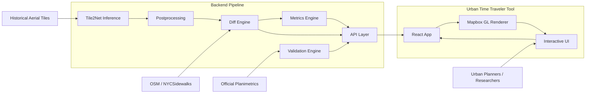

```mermaid
flowchart LR

    %% DATA SOURCES
    A[Historical Aerial Tiles] --> D
    B[Official Planimetrics] --> H
    C[OSM / NYCSidewalks] --> F

    %% BACKEND PIPELINE
    subgraph Backend [Backend Pipeline]
        D[Tile2Net Inference] --> E[Postprocessing]
        E --> F[Diff Engine]
        F --> G[Metrics Engine]
        H[Validation Engine] --> I[API Layer]
        G --> I
        F --> I
    end

    %% FRONTEND
    subgraph Frontend [Urban Time Traveler Tool]
        I --> J[React App]
        J --> K[Mapbox GL Renderer]
        K --> L[Interactive UI]
        L --> J
    end

    U[Urban Planners / Researchers] --> L
```

